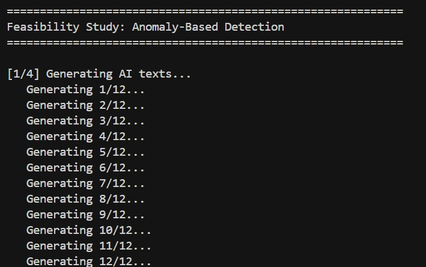
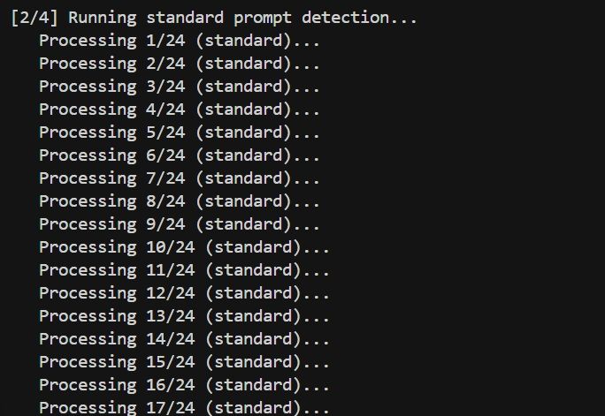
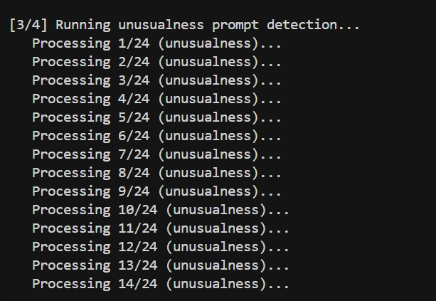
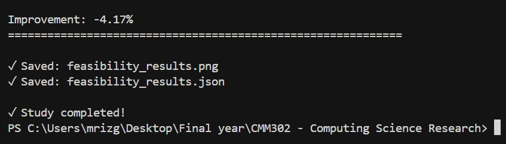

# Feasibility Study: Anomaly-Based Detection of Human Text

Code and results for the feasibility study using OpenAI's GPT-4o-mini API.

## Overview

Tested whether anomaly-oriented prompts can distinguish human from AI-generated text:
- **12 human texts** (simple conversational samples created for this study)
- **12 AI texts** (generated using GPT-4o-mini)
- **Two prompts**: standard detection and unusualness-based anomaly prompt

**Note**: For the full research, human texts will be sourced from public datasets (pre-2020 Wikipedia, academic papers, HC3 benchmark) as specified in the research proposal.

## Results

- **Standard Prompt**: 100% accuracy (24/24 correctly classified)
- **Unusualness Prompt**: 95.8% accuracy (23/24 correctly classified)

Results validate that anomaly-oriented prompts can effectively distinguish human from AI text.

## Files

- `feasibility_study.py` - Main script
- `feasibility_results.png` - Visualizations (also in `screenshoots/`)
- `feasibility_results.json` - Complete results data
- `human_texts_dataset.txt` - Human texts used
- `screenshoots/` - Process screenshots (1-5.jpg)

## Setup

1. **Install dependencies:**
   ```bash
   pip install -r requirements.txt
   ```

2. **Set OpenAI API key:**
   ```bash
   # Windows PowerShell
   $env:OPENAI_API_KEY="your_key_here"
   
   # Windows CMD
   setx OPENAI_API_KEY "your_key_here"
   
   # Linux/Mac
   export OPENAI_API_KEY="your_key_here"
   ```

## Running

```bash
python feasibility_study.py
```

The script will:
1. Load 12 human texts
2. Generate 12 AI texts
3. Test both prompts on all 24 texts
4. Compute metrics and generate visualizations
5. Save results to JSON

**Runtime**: ~2-3 minutes (36 API calls with 1-second delays)

## Key Findings

- Standard prompt achieved perfect classification
- Unusualness prompt achieved 95.8% accuracy (1 false negative)
- Clear separation between human and AI score distributions
- Approach is feasible for larger-scale experiments

## Methodology

**Standard Prompt**: "Is this text written by a human or AI? Respond with 'Answer: Human' or 'Answer: AI' and a confidence score (0-100)."

**Unusualness Prompt**: "On a scale of 0-100, how unusual is this text compared to typical AI output? Respond with 'Assessment: [score]' and then 'Answer: Human' or 'Answer: AI'."

## Screenshots

### Screenshot 1: Processing Anomaly-Based Detection


### Screenshot 2: Processing Standard Prompt Detection


### Screenshot 3: Processing Unusualness Prompt Detection


### Screenshot 4: Computing Metrics and Visualization


### Screenshot 5: Final Output


### Feasibility Results Visualization


## Notes

- Human texts were created specifically for this feasibility study (not from a public dataset)
- Full research will use verified public datasets to ensure authenticity
- Results are reproducible with the same API key and model version
- Study demonstrates feasibility for the full research project

